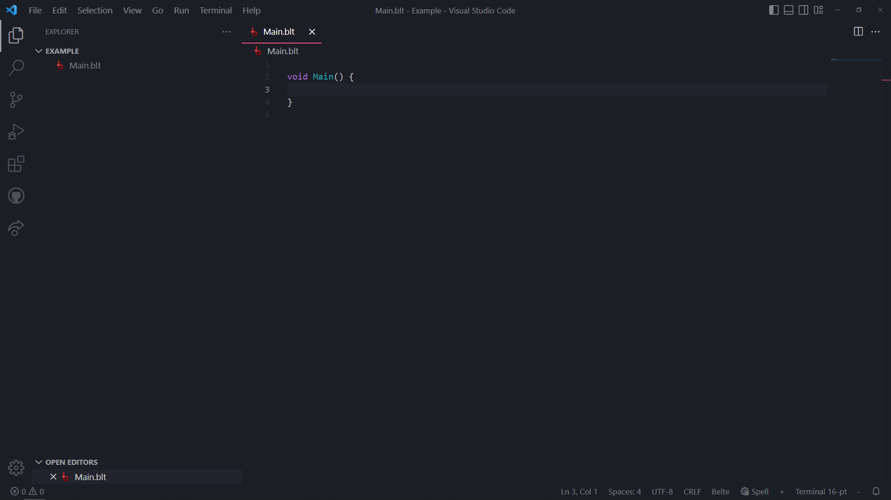

Belte is compatible with many projects. You can compile straight down to an executable for your platform, you can
compile for .NET core and seamlessly integrate Belte code into .NET projects, or you can interpret your code, running
it on the spot!

To start, make your first source file with the extension `.blt` (e.g. `Main.blt`). Start your program with a `Main`
method exactly as shown in the image below. When you run your program, it will execute all the code top to bottom
within `Main`.

> Next: Hello World! (Under Construction)
<!-- > Next: [Hello World!](Tutorial/HelloWorld.md) -->
