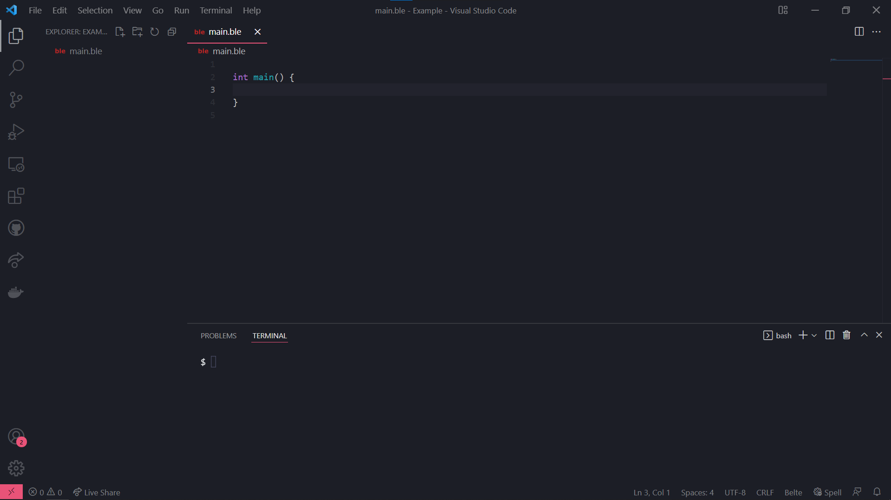

# Getting Started

Belte is compatible with many projects. You can compile strait down to an executable for your platform, or you can
compile for .NET core. This allows .NET projects to seamlessly use Belte without disrupting the project.

To start make a source file the with extension `.ble`. Start your program with a `main()` function (the default entry
point) and you can start coding!

> Next: [Hello World!](Tutorial/HelloWorld.md)
