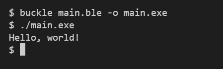

# Hello World Program

Once you have your main file, you can include `System.Stdout` to b able to print to stdout (terminal).

We will be using `Stdout.print` to print a single string. Finally we will end the program with `return 0` to indicate that the program successfully ran.

Next you can use the Buckle compiler to compile your program into a runnable executable.

> Next: [Calculator App](Calculator.md)
