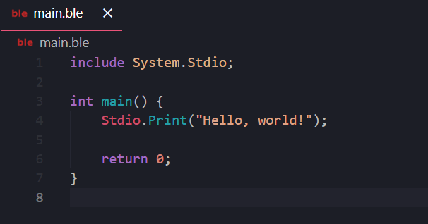
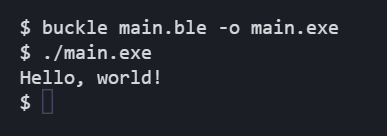

# Hello World Program

Once you have your main file, you can include `System.Stdio` to b able to print to stdout (terminal).

We will be using `Stdio.Print` to print a single string. Finally we will end the program with `return 0` to indicate that the program successfully ran.

Next you can use the Buckle compiler to compile your program into a runnable executable.

> Next: [Simple Calculator](Calculator.md)
